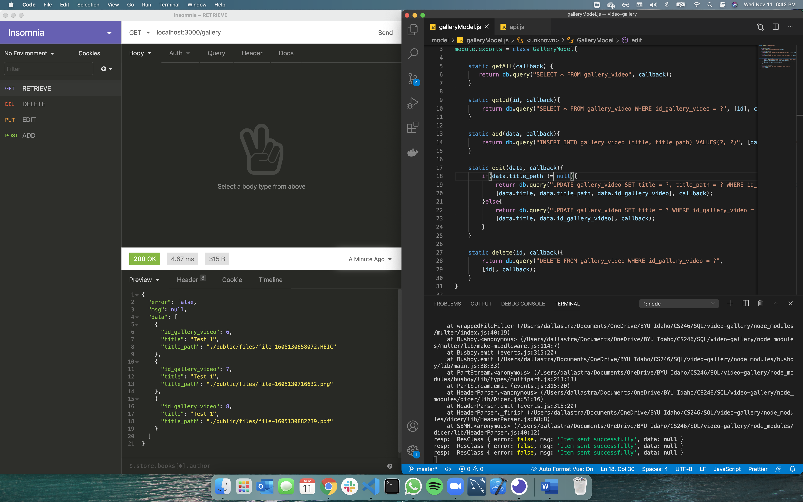

# OVERVIEW

This is a project for learning SQL database.
The idea here was to develop a simple API that ADD/EDIT/DELETE files and a simple function to RETRIEVE all the data. The whole API is ready and the Fontend will be created later.

## Development Environment

* Visual Studio Code
* MySQL
* Workbench
* NodeJS
* Express
* Insomnia

## Execution

After cloning it, use on the terminal "npm install" to allow the packages to be installed in your machine and then run "node api.js" to make it live.
I used Insomnia to work with the requests (GET/POST/PUT/DELETE) but it is possible to try it out through the browser or other software.

